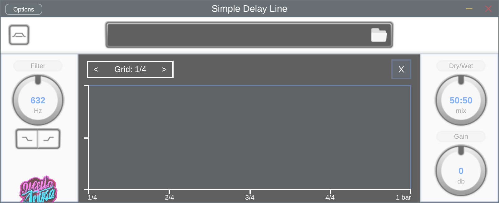

# Mini Portfolio

A small list of projects that I am proud of publicly displaying.

# Portfolio Projects

    
    

        <h2>Project 1</h2>
        
Description of Project 1 goes here. Lorem ipsum dolor sit amet, consectetur adipiscing elit.

        <a href="https://github.com/jaeckl/stereo-multitap-delay" target="_blank">View Repository</a>
    

    
    

        <h2>Project 2</h2>
        
Description of Project 2 goes here. Lorem ipsum dolor sit amet, consectetur adipiscing elit.

        <a href="https://github.com/jaeckl/extrude-mesh" target="_blank">View Repository</a>
    

